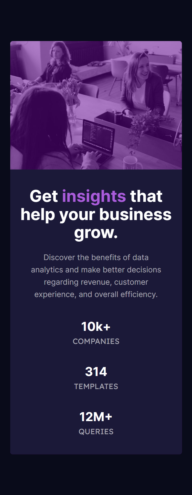

# Frontend Mentor - Stats preview card component solution

This is a solution to the [Stats preview card component challenge on Frontend Mentor](https://www.frontendmentor.io/challenges/stats-preview-card-component-8JqbgoU62). Frontend Mentor challenges help you improve your coding skills by building realistic projects. 

## Table of contents

- [Overview](#overview)
  - [The challenge](#the-challenge)
  - [Screenshot](#screenshot)
  - [Links](#links)
- [My process](#my-process)
  - [Built with](#built-with)
  - [What I learned](#what-i-learned)
  - [Continued development](#continued-development)
  - [Useful resources](#useful-resources)
- [Author](#author)

## Overview

### The challenge

Users should be able to:

- View the optimal layout depending on their device's screen size

### Screenshot

### Links

- Solution URL: (https://github.com/vishy351/stats-preview-card)
- Live Site URL: (https://vishy351.github.io/stats-preview-card/)

## My process

### Built with

- HTML5
- CSS
- Flexbox
- Mobile-first workflow

### What I learned

- HTML vs Body: How to Set Width and Height for Full Page Size
- How to use CSS reset
- How to make a box semi-transparent

### Continued development

I would like to focus on how to work with flexbox and setting up background images with desired settings

### Useful resources

- HTML vs Body: How to Set Width and Height for Full Page Size (https://www.freecodecamp.org/news/html-page-width-height/ ) - This is extremely helpful specially for a beginner web developer like me. I think everyone should have a look.
- How to use CSS reset (https://stackoverflow.com/questions/8715860/what-does-mean-in-css)
- How to make a box semi-transparent (https://developer.mozilla.org/en-US/docs/Learn/CSS/Howto/Make_box_transparent)

## Author

- Frontend Mentor - [@vishy351](https://www.frontendmentor.io/profile/vishy351)
- Github - (https://github.com/vishy351)
